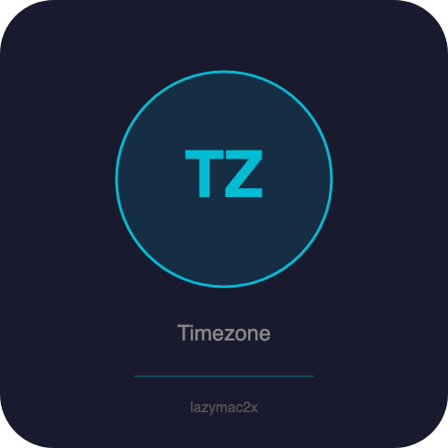

<p align="center"></p>

[](https://lazymac2x.github.io/lazymac-api-store/) [](https://coindany.gumroad.com/) [](https://mcpize.com/mcp/timezone-api)

# timezone-api

[](https://www.npmjs.com/package/@lazymac/mcp)
[](https://smithery.ai/server/lazymac/mcp)
[](https://coindany.gumroad.com/l/zlewvz)
[](https://api.lazy-mac.com)

> 🚀 Want all 42 lazymac tools through ONE MCP install? `npx -y @lazymac/mcp` · [Pro $29/mo](https://coindany.gumroad.com/l/zlewvz) for unlimited calls.

Timezone conversion API — current time in any zone, convert between timezones, world clock, meeting planner. Supports IANA names + common abbreviations (EST, KST, JST, etc).

## Quick Start
```bash
npm install && npm start  # http://localhost:4800
```

## Endpoints
```bash
# Current time in Seoul
curl http://localhost:4800/api/v1/now/KST

# Convert time between zones
curl "http://localhost:4800/api/v1/convert?datetime=2026-03-21T09:00&from=KST&to=EST"

# World clock
curl -X POST http://localhost:4800/api/v1/world-clock \
  -H "Content-Type: application/json" \
  -d '{"zones":["KST","EST","PST","CET","JST"]}'

# Meeting planner — find overlapping work hours
curl -X POST http://localhost:4800/api/v1/meeting-planner \
  -H "Content-Type: application/json" \
  -d '{"zones":["KST","EST","CET"],"workHours":[9,18]}'

# List all supported zones
curl http://localhost:4800/api/v1/zones
```

## License
MIT

<sub>💡 Host your own stack? <a href="https://m.do.co/c/c8c07a9d3273">Get $200 DigitalOcean credit</a> via lazymac referral link.</sub>
